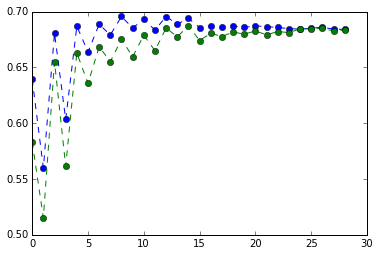

# Text Analytics Group Assignment 2

The data for this assignment is the Yelp Restaurant Review Data. 
This Yelp dataset has information on restaurants (e.g., type of food, price range, etc.) as well as reviews written by patrons. The output variable is the star rating (1-5). It will be best to convert this rating to high (say, ratings of 4 & 5) and low (1, 2, 3). 

## Task A. Ignore the text (reviews) and run a classification model with the numeric data (you can use standard methods like logistic regression, k-nearest neighbors or anything else). What is the best accuracy of your model?

Logistic Regression and KNN performed similarly with test accuracies of 69.5%.

    import pandas as pd
    import numpy as np
    from pandas import Series
    from pandas import DataFrame
    from patsy import dmatrices
    from sklearn.cross_validation import train_test_split,StratifiedShuffleSplit,StratifiedKFold
    from sklearn.linear_model import LogisticRegression
    from sklearn import metrics
    from sklearn import neighbors
    import random
    from sklearn.feature_extraction.text import TfidfVectorizer
    from sklearn.naive_bayes import MultinomialNB
    import scipy.sparse
    import matplotlib.pyplot as plt
    %pylab inline
    import operator
    import sklearn.cluster
    from nltk import word_tokenize
    from nltk import pos_tag
    from nltk.corpus import stopwords
    import itertools
    import nltk
    from operator import itemgetter

    Populating the interactive namespace from numpy and matplotlib
    

    WARNING: pylab import has clobbered these variables: ['sample', 'random', 'test', 'var']
    `%matplotlib` prevents importing * from pylab and numpy
    

    yelp = pd.read_csv("Yelp Data Restaurant Reviews Ratings.csv")

    # create output variable 'high'
    high_mask = yelp['stars'] > 3
    yelp['High'] = 0
    yelp.ix[high_mask, 'High'] = 1

    train = yelp.sample(int(0.7*len(yelp)),replace=False).copy()
    test = yelp[~yelp.index.isin(train.index.values)].copy()

    train_x = train.drop(["stars","Review","High"], axis=1).copy()
    train_y = train['High']
    test_x = test.drop(["stars","Review","High"], axis=1).copy()
    test_y = test['High']

    # function for accuracy and confusion matrix output
    def confusion_matrix(predicted, actual):
        print "Percent Correct\n", round((predicted==actual).mean()*100, 3)
        print "\nConfusion Matrix\n", pd.crosstab(index=actual,columns=predicted)
        print "\nProportion Table\n", pd.crosstab(index=actual,columns=predicted).apply(lambda r: r/r.sum(), axis=1)

###Logistic Regression

    logistic_model = LogisticRegression()
    logistic_result = logistic_model.fit(train_x, train_y)

    logistic_train_prediction = logistic_model.predict(train_x)
    confusion_matrix(logistic_train_prediction, train_y) # print training accuracy

    Percent Correct
    67.891
    
    Confusion Matrix
    col_0    0     1
    High            
    0      233  4328
    1      167  9271
    
    Proportion Table
    col_0         0         1
    High                     
    0      0.051085  0.948915
    1      0.017694  0.982306
    

    logistic_test_prediction = logistic_model.predict(test_x)
    confusion_matrix(logistic_test_prediction, test_y) # print test accuracy

    Percent Correct
    69.55
    
    Confusion Matrix
    col_0    0     1
    High            
    0      120  1765
    1       62  4053
    
    Proportion Table
    col_0         0         1
    High                     
    0      0.063660  0.936340
    1      0.015067  0.984933
    

###KNN

    train_accuracies = {}
    test_accuracies = {}
    
    for i in range(1, 30, 1): # loop through different values of k
        knn_model = neighbors.KNeighborsClassifier(n_neighbors=i, weights='uniform', p=2)
        knn_result = knn_model.fit(train_x, train_y)
        knn_train_prediction = knn_model.predict(train_x)
        train_accuracies[i] = metrics.accuracy_score(train_y, knn_train_prediction)
        knn_test_prediction = knn_model.predict(test_x)
        test_accuracies[i] = metrics.accuracy_score(test_y, knn_test_prediction)

    plt.plot(train_accuracies.values(), marker="o", linestyle="--")
    plt.plot(test_accuracies.values(), marker="o", linestyle="--")

    [<matplotlib.lines.Line2D at 0x180b8588>]

    max(test_accuracies.iteritems(), key=operator.itemgetter(1))[0]

    25

    train_accuracies[25]

    0.69519251375098223

    train_accuracies[25]

    0.69519251375098223

##Task B. Perform a supervised classification on a subset of the corpus using the reviews only. You can write your code in Python or R. What accuracy do you get from this text mining exercise?

Running Naive Bayes on a random sample of the text data gave us a test accuracy of 68.87%. Seeing that our data is highly imbalanced, we tried undersampling the dataset to ensure a 50/50 split of the classes. This increased accuracy to 80%. Looking at the confusion matrices, we can see that undersampling made the model better at predicting 0's.

###Random Sampling

    np.random.seed(1234567)
    train = yelp.sample(int(len(yelp)*0.7), replace=False)

    test = yelp[~yelp.index.isin(train.index.values)]

    train_x = train['Review']
    train_y = train['High']
    test_x = test['Review']
    test_y = test['High']

    v = TfidfVectorizer(min_df=0,smooth_idf=True, strip_accents='unicode', norm='l2')

    def text_classification():
        x_train = v.fit_transform(train_x)
        x_test = v.transform(test_x)
        
        nb_classifier = MultinomialNB().fit(x_train, train_y)
        train_prediction = nb_classifier.predict(x_train)
        test_prediction = nb_classifier.predict(x_test)
        print("Train:")
        confusion_matrix(train_prediction, train_y)
        print("\nTest:")
        confusion_matrix(test_prediction, test_y)

    text_classification()

    Train:
    Percent Correct
    70.526
    
    Confusion Matrix
    col_0    0     1
    High            
    0      368  4124
    1        2  9505
    
    Proportion Table
    col_0         0         1
    High                     
    0      0.081923  0.918077
    1      0.000210  0.999790
    
    Test:
    Percent Correct
    68.867
    
    Confusion Matrix
    col_0   0     1
    High           
    0      89  1865
    1       3  4043
    
    Proportion Table
    col_0         0         1
    High                     
    0      0.045548  0.954452
    1      0.000741  0.999259
    

###Undersampling data set to ensure 50/50 split

    yelp['High'].value_counts() # imbalanced data set

    1    13553
    0     6446
    dtype: int64

    highs = yelp[yelp['High']==1]
    lows = yelp[yelp['High']==0]

    sample_high = highs.sample(len(lows),replace=False).copy()

    sample = sample_high.append(lows, ignore_index=True)

    train = sample.sample(int(0.7*len(sample)),replace=False).copy()
    test = sample[~sample.index.isin(train.index.values)].copy()

    train_x = train['Review']
    train_y = train['High']
    test_x = test['Review']
    test_y = test['High']

    text_classification()

    Train:
    Percent Correct
    89.351
    
    Confusion Matrix
    col_0     0     1
    High             
    0      4066   405
    1       556  3997
    
    Proportion Table
    col_0         0         1
    High                     
    0      0.909416  0.090584
    1      0.122117  0.877883
    
    Test:
    Percent Correct
    80.455
    
    Confusion Matrix
    col_0     0     1
    High             
    0      1643   332
    1       424  1469
    
    Proportion Table
    col_0         0         1
    High                     
    0      0.831899  0.168101
    1      0.223983  0.776017
    

##Task C. Combine the numeric data and the text classification model (in task B) to create a “hybrid” model. It is your task to figure out how to do this. Now run this hybrid classification model and compare the results with those in A and B. 

The test accuracy of the hybrid model is 79%, better than the non-text model (69%), but slightly worse than the text model (80%). The hybrid model does a little better than the text model at predicting 1's. 

    text_train = v.fit_transform(train_x) # just the reviews
    numeric_train = train.drop(["Review", "stars", "High"], axis=1).copy()
    numeric_sparse_train = scipy.sparse.csr_matrix(numeric_train.to_sparse())
    combined_train = scipy.sparse.hstack([text_train, numeric_sparse_train]) # combining numeric and text

    text_test = v.transform(test_x) # repeating above for test
    numeric_test = test.drop(["Review", "stars", "High"], axis=1).copy()
    numeric_sparse_test = scipy.sparse.csr_matrix(numeric_test.to_sparse())
    combined_test = scipy.sparse.hstack([text_test, numeric_sparse_test])

    nb_classifier = MultinomialNB().fit(combined_train, train_y)
    train_prediction = nb_classifier.predict(combined_train)
    test_prediction = nb_classifier.predict(combined_test)
    print("Train:")
    confusion_matrix(train_prediction, train_y)
    print("\nTest:")
    confusion_matrix(test_prediction, test_y)

    Train:
    Percent Correct
    87.81
    
    Confusion Matrix
    col_0     0     1
    High             
    0      3905   566
    1       534  4019
    
    Proportion Table
    col_0         0         1
    High                     
    0      0.873406  0.126594
    1      0.117285  0.882715
    
    Test:
    Percent Correct
    79.162
    
    Confusion Matrix
    col_0     0     1
    High             
    0      1553   422
    1       384  1509
    
    Proportion Table
    col_0         0         1
    High                     
    0      0.786329  0.213671
    1      0.202853  0.797147
    

## Task D. Use unsupervised sentiment analysis on the reviews (with SentiStrength or any other tool) and use the sentiment score to predict high/low rating. Compare and contrast the results of tasks B and D. What can you conclude from your analysis?

The results were poor. The accuracy was 58.47%, which is just slightly better than random guessing. Unsupervised sentiment analysis by itself does not seem to be a good way to predict rating.

    sentiment = pd.read_excel("SentiStrength output.xlsx")

    C:\Users\Julia Wu\Anaconda\lib\site-packages\xlrd\xlsx.py:246: PendingDeprecationWarning: This method will be removed in future versions.  Use 'tree.iter()' or 'list(tree.iter())' instead.
      for elem in self.tree.getiterator():
    C:\Users\Julia Wu\Anaconda\lib\site-packages\xlrd\xlsx.py:292: PendingDeprecationWarning: This method will be removed in future versions.  Use 'tree.iter()' or 'list(tree.iter())' instead.
      for elem in self.tree.getiterator():
    

    sentiment['total_sent'] = sentiment['pos_sent'] + sentiment['neg_sent']

    sentiment['Actual'] = yelp['High']

    pos_sent_mask = sentiment['total_sent'] > 0
    sentiment['Predicted'] = 0
    sentiment.ix[pos_sent_mask, 'Predicted'] = 1

    confusion_matrix(sentiment['Predicted'], sentiment['Actual'])

    Percent Correct
    58.471
    
    Confusion Matrix
    Predicted     0     1
    Actual               
    0          2354  4092
    1          4213  9339
    
    Proportion Table
    Predicted         0         1
    Actual                       
    0          0.365188  0.634812
    1          0.310877  0.689123
    

## Task E. Use unsupervised clustering on the text. Does clustering achieve “good” separation between high and low rated restaurants? How can you explain the result?

Unsupervised clustering did better than unsupervised sentiment analysis with an accuracy of 60%. This makes sense because we used the document term matrix and the type of words people use can be indicative of what they think about the restaurant. Sentiment, on the other hand, can be difficult to gauge.

    DTMReviews = v.fit_transform(yelp['Review'])

    cluster = sklearn.cluster.KMeans(n_clusters=2, random_state=1)
    cluster_out = cluster.fit(DTMReviews)

    cluster_out = Series(cluster_out.labels_)

    yelp['Cluster_Predicted'] = cluster_out

    confusion_matrix(yelp['Cluster_Predicted'], yelp['High'])

    Percent Correct
    59.823
    
    Confusion Matrix
    Cluster_Predicted     0     1
    High                         
    0                  3521  2925
    1                  5110  8443
    
    Proportion Table
    Cluster_Predicted         0         1
    High                                 
    0                  0.546230  0.453770
    1                  0.377038  0.622962
    

## Task F. What are the top 5 “attributes” of a restaurant that are associated with (i) high and (ii) low ratings?

Below we find the top 5 attributes/nouns associated with restaurants with high and low ratings. The attributes discussed are fairly similar regardless of whether it is a high or low rating and consist of things like the 'food', 'place', 'service', and 'restaurant'. It is the words used to describe these nouns that differ. Following what we did in assignment 1, we decided to use log probability ratios to find words that are likely to be found in one class but not the other. Words like 'gem', 'amazing', 'perfect', 'windsor', and 'fantastic' described attributes of restaurants with high ratings and words like 'worse', 'mediocre', 'tasteless', 'worst', and 'terrible' described attributes of restaurants with low ratings.

    review_highs = highs['Review']
    review_lows = lows['Review']

    review_highs = review_highs.str.decode("utf-8")
    review_lows = review_lows.str.decode("utf-8")

    review_highs = review_highs.map(word_tokenize)
    review_lows = review_lows.map(word_tokenize)

    review_highs = list(review_highs)
    review_lows = list(review_lows)

    review_highs = list(itertools.chain.from_iterable(review_highs))
    review_lows = list(itertools.chain.from_iterable(review_lows))

    highs_lower = [word.lower() for word in review_highs if word.isalpha()]
    lows_lower = [word.lower() for word in review_lows if word.isalpha()]

    highs_vc = Series(highs_lower).value_counts()
    lows_vc = Series(lows_lower).value_counts()

    highs_clean = [word for word in highs_vc.index if word not in stopwords.words("english")]
    lows_clean = [word for word in lows_vc.index if word not in stopwords.words("english")]

    tag_high50 = pos_tag(highs_clean[:50])
    tag_low50 = pos_tag(lows_clean[:50])

    high_attributes = [word for word, tag in tag_high50 if tag.startswith("NN")]
    low_attributes = [word for word, tag in tag_low50 if tag.startswith("NN")]

    high_attributes[:5]

    [u'food', u'place', u'service', u'menu', u'restaurant']

    low_attributes[:5]

    [u'food', u'place', u'service', u'restaurant', u'order']

    stop_vectorizer = \
    TfidfVectorizer(min_df=0, smooth_idf=True, strip_accents='unicode',\
                    norm='l2', stop_words="english")
    
    stop_train_x = stop_vectorizer.fit_transform(train_x)
    stop_test_x = stop_vectorizer.transform(test_x)
    stop_nb_classifier = MultinomialNB().fit(stop_train_x, train_y)

    class0log = stop_nb_classifier.feature_log_prob_[0]
    class1log = stop_nb_classifier.feature_log_prob_[1]
    
    class1log_exp = []
    
    for i in class1log:
        class1log_exp.append(math.exp(i))
    
    class0log_exp = []
    for j in class0log:
        class0log_exp.append(math.exp(j))
    
    ratio = []
    for index, var in enumerate(class1log_exp):
        ratio.append(class0log_exp[index]/var)
    
    vocabulary = np.array([t for t, i in sorted(stop_vectorizer.vocabulary_.iteritems(), key=itemgetter(1))])
    
    bottom5 = np.argsort(ratio)[:5]
    print('Words most indicative of a high rating:')
    print(" ".join(vocabulary[bottom5]))
    top5 = np.argsort(ratio)[-5:]
    print('\nWords most indicative of a low rating: ')
    print(" ".join(vocabulary[top5]))

    Words most indicative of a high rating:
    gem amazing perfect windsor fantastic
    
    Words most indicative of a low rating: 
    worse mediocre tasteless worst terrible
    
