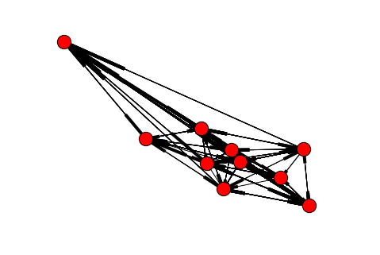
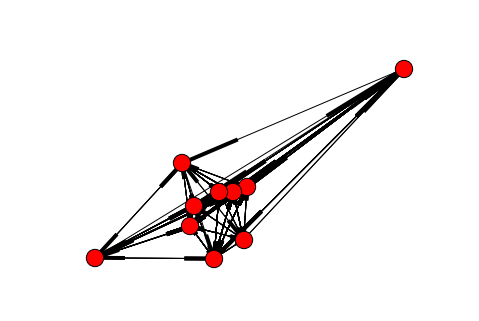
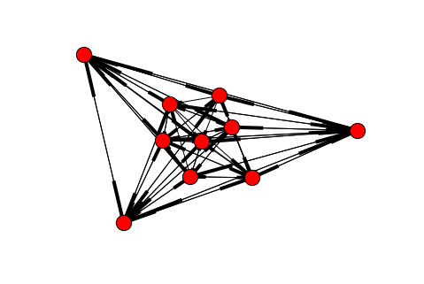
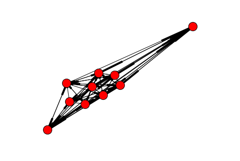
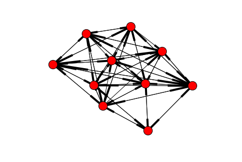
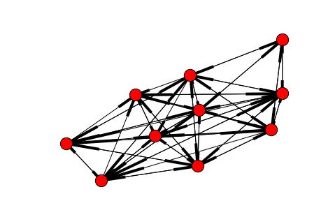
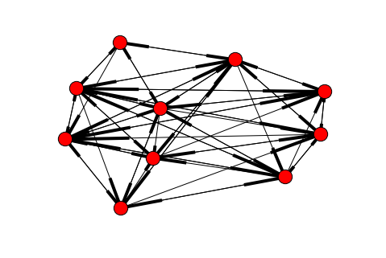

#Text Analytics Group Assignment 3

###Task A. The sentiment scores worksheet in the data file “Assignment 3 Sentiment Scores.csv” (on Canvas) provides sentiment scores (+5 to -5) of forum users on 10 car models. Each row represents a post (not shown) that can mention multiple models. Only positive and negative sentiments are noted. 

###From these sentiment scores, create a directed product comparison network (and use NodeXL or, even better, write your own code in Python using networkx or R). Use the principles laid out in the article “Product comparison networks” to answer this question. 

```python
import networkx as nx
import sys, csv
import math
import numpy as np
import matplotlib.pyplot as plt
import pandas as pd
import scipy
import nltk.data
import fnmatch
import copy
import warnings
import textblob
from textblob import TextBlob
warnings.filterwarnings('ignore')
from copy import deepcopy
from scipy import stats
from pandas import Series, DataFrame
from nltk.tokenize import RegexpTokenizer
from nltk.corpus import stopwords
from nltk.stem.wordnet import WordNetLemmatizer
%matplotlib inline
from networkx import pagerank


senti = pd.read_csv('Assignment 3 Sentiment Scores.csv')
products = senti.columns.values
```
Below we have created 4 different product comparison networks: multi-link unweighted graph, multi-link weighted graph, dichotomic unweighted, and dichotomic weighted.

```python
# Unweighted MultiLink Graph
def notnullmask(data, columnname):
	"""For a chosen column, returns data frame with the values in the chosen column not equal to null"""
	mask = data[columnname].notnull()
	return data[mask]

def compare2p(data, p1, p2):
	"""Returns a dataframe with product 1 and product 2 both with not null values"""
	p1notnull = notnullmask(data,p1)
	p2notnull = notnullmask(p1notnull, p2)
	return p2notnull

def addnode(data, p1, p2,graph):
	"""Adds an edge from p1 to p2 if p2's score is higher than p1, and vice versa"""
	for i in range(len(data)):
		if data[p1].values[i] < data[p2].values[i]:
			graph.add_edge(p1,p2)
		elif data[p1].values[i] > data[p2].values[i]:
			graph.add_edge(p2,p1)
		else:
			pass
		
def UnweightedMultiLink(data, productlist, graph):
	"""Creates an unweighted multilink graph"""
	for i in productlist:
		#Compare i with the rest of the products in productlist and avoid repetition in comparing
		productlist = [p for p in productlist if p!= i] 
		for j in range(len(productlist)):
			comparison = compare2p(data, i, productlist[j]) #compare two products at a time
			addnode(comparison, i, productlist[j], graph)
	nx.draw(graph)
	plt.show()
U = nx.MultiDiGraph()
UnweightedMultiLink(senti, products, U)
print products
```




    ['ES' 'LS' 'RX' 'A8' 'A6' '3series' '5series' '7series' 'XJ' 'Sclass']
    

```python
# Weighted MultiLink Graph
def addweightednode(data, p1, p2, graph):
	"""Adds an edge with the weights from p1 to p2 if p2's score is higher than p1, and vice versa"""
	for i in range(len(data)):
		if data[p1].values[i] < data[p2].values[i]:
			weights = data[p2].values[i] - data[p1].values[i]
			graph.add_edge(p1,p2, weight = weights)
		elif data[p1].values[i] > data[p2].values[i]:
			weights = data[p1].values[i] - data[p2].values[i]
			graph.add_edge(p2,p1,weight = weights)
		else:
			pass

def WeightedMultiLink(data, productlist, graph):
	for i in productlist:
		productlist = [p for p in productlist if p!= i]
		for j in range(len(productlist)):
			comparison = compare2p(data, i, productlist[j])
			addweightednode(comparison, i, productlist[j], graph)
	nx.draw(graph)
	plt.show()
G = nx.MultiDiGraph() 
WeightedMultiLink(senti, products, G)
print products
```




    ['ES' 'LS' 'RX' 'A8' 'A6' '3series' '5series' '7series' 'XJ' 'Sclass']
    

```python
# Unweighted Dichotomic Network
def addnodeDich(data, p1, p2, graph):
	"""Sums the pos and neg score and add an edge in each direction depending on the count of each score"""
	pos = 0
	neg = 0
	negcount = 0
	poscount = 0
	for i in range(len(data)):
		if data[p1].values[i] < data[p2].values[i]:
			# p1 to p2
			negval = data[p2].values[i] - data[p1].values[i]
			neg += negval
			negcount += 1
		elif data[p1].values[i] > data[p2].values[i]:
			# p2 to p1
			posval = data[p1].values[i] - data[p2].values[i] 
			pos += posval
			poscount += 1
		else:
			pass 
	if negcount != 0 and poscount != 0:
		graph.add_edge(p1,p2)
		graph.add_edge(p2,p1)
	elif poscount != 0:
		graph.add_edge(p2,p1)
	elif negcount != 0:
		graph.add_edge(p1,p2)
	else:
		pass
	
def DichotomicNetwork(data, productlist, graph):
	for i in productlist:
		productlist = [p for p in productlist if p!= i]
		for j in range(len(productlist)):
			comparison = compare2p(data, i, productlist[j])
			addnodeDich(comparison, i, productlist[j], graph)
	nx.draw(graph)
	plt.show()


Dich = nx.DiGraph()
DichotomicNetwork(senti, products, Dich)
print products
```




    ['ES' 'LS' 'RX' 'A8' 'A6' '3series' '5series' '7series' 'XJ' 'Sclass']
    

```python
def addnodeDich_weighted(data,p1,p2, graph):
	"""Sums the pos and neg scores, divide the sum scores by its count and add an weighted edge in each direction"""
	pos = 0
	neg = 0
	negcount = 0
	poscount = 0
	for i in range(len(data)):
		if data[p1].values[i] < data[p2].values[i]:
			#p1 to p2
			negval = data[p2].values[i] - data[p1].values[i]
			neg += negval
			negcount += 1
		elif data[p1].values[i] > data[p2].values[i]:
			#p2 to p1
			posval = data[p1].values[i] - data[p2].values[i] 
			pos += posval
			poscount += 1
		else:
			pass 
	if negcount != 0 and poscount != 0:
		negweight = float(neg)/negcount
		posweight = float(pos)/poscount
		graph.add_edge(p1,p2, weight = negweight)
		graph.add_edge(p2,p1, weight = posweight)
	elif poscount != 0:
		posweight = float(pos)/poscount
		graph.add_edge(p2,p1, weight = posweight)
	elif negcount != 0:
		negweight = float(neg)/negcount
		graph.add_edge(p1,p2, weight = negweight)
	else:
		pass
	
def DichotomicNetwork_weighted(data, productlist, graph):
	for i in productlist:
		productlist = [p for p in productlist if p!= i]
		for j in range(len(productlist)):
			comparison = compare2p(data, i, productlist[j])
			addnodeDich_weighted(comparison, i, productlist[j], graph)
	nx.draw(graph)
	plt.show()


Dich_weighted = nx.DiGraph()
DichotomicNetwork_weighted(senti, products, Dich_weighted)
print products
```




    ['ES' 'LS' 'RX' 'A8' 'A6' '3series' '5series' '7series' 'XJ' 'Sclass']
    

###Task B. Calculate both unweighted and weighted PageRank scores for each car. Note that NodeXL can’t calculate weighted PageRank scores. What are the correlations between these metrics and sales figures shown below? What additional information do weighted PageRanks capture? Use a python script to calculate weighted PageRanks. Unweighted PageRanks can be calculated in NodeXL, or you can write a python script for that task as well.

Below we use the unweighted dichotomic comparison network and weighted dichotomic comparison network to calculate our unweighted and weighted PageRanks. 

```python
Sales_dict = {'3series': 220000,
 '5series': 60000,
 '7series': 14000,
 'A6': 20000,
 'A8': 12000,
 'ES': 135000,
 'LS': 30000,
 'RX': 120000,
 'Sclass': 25000,
 'XJ': 6600}
df = DataFrame({'Sales': Sales_dict, 'Unweighted PageRank': nx.pagerank(Dich), 
					  'Weighted PageRank': nx.pagerank(Dich_weighted) })
df
```


<div>
<table border="1" class="dataframe">
  <thead>
    <tr style="text-align: right;">
      <th></th>
      <th>Sales</th>
      <th>Unweighted PageRank</th>
      <th>Weighted PageRank</th>
    </tr>
  </thead>
  <tbody>
    <tr>
      <th>3series</th>
      <td>220000</td>
      <td>0.092526</td>
      <td>0.135974</td>
    </tr>
    <tr>
      <th>5series</th>
      <td>60000</td>
      <td>0.077500</td>
      <td>0.088448</td>
    </tr>
    <tr>
      <th>7series</th>
      <td>14000</td>
      <td>0.109464</td>
      <td>0.101003</td>
    </tr>
    <tr>
      <th>A6</th>
      <td>20000</td>
      <td>0.085367</td>
      <td>0.071297</td>
    </tr>
    <tr>
      <th>A8</th>
      <td>12000</td>
      <td>0.110645</td>
      <td>0.098606</td>
    </tr>
    <tr>
      <th>ES</th>
      <td>135000</td>
      <td>0.110645</td>
      <td>0.109308</td>
    </tr>
    <tr>
      <th>LS</th>
      <td>30000</td>
      <td>0.110645</td>
      <td>0.111356</td>
    </tr>
    <tr>
      <th>RX</th>
      <td>120000</td>
      <td>0.106068</td>
      <td>0.105513</td>
    </tr>
    <tr>
      <th>Sclass</th>
      <td>25000</td>
      <td>0.110645</td>
      <td>0.103705</td>
    </tr>
    <tr>
      <th>XJ</th>
      <td>6600</td>
      <td>0.086495</td>
      <td>0.074791</td>
    </tr>
  </tbody>
</table>
</div>


Following the methodology in the Product Comparison Network article, we will use standard, Spearman's, and Kendall's methods of correlation and investigate the correlation and p-values.

```python
saleslist = df['Sales'].tolist()
UPRlist = df['Unweighted PageRank'].tolist()
WPRlist = df['Weighted PageRank'].tolist()

tau_uw, p_value_uw = stats.kendalltau(saleslist, UPRlist)
rho_uw, pval_uw = stats.spearmanr(saleslist, UPRlist)
corr_uw, p_val_uw = stats.pearsonr(saleslist, UPRlist)
stats_dict = {'Kendall Corr': tau_uw,
			   'Kendall P-Value': p_value_uw,
			   'Spearman Corr': rho_uw,
				'Spearman P-Value': pval_uw,
				 'Pearson(Standard) Corr': corr_uw,
				 'Pearson (Standard) P-Value': p_val_uw}

tau_w, p_value_w = stats.kendalltau(saleslist, WPRlist)
rho_w, pval_w = stats.spearmanr(saleslist, WPRlist)
corr_w, p_val_w = stats.pearsonr(saleslist, WPRlist)
stats_dict_w = {'Kendall Corr': tau_w,
			   'Kendall P-Value': p_value_w,
			   'Spearman Corr': rho_w,
				'Spearman P-Value': pval_w,
				'Pearson(Standard) Corr': corr_w,
				 'Pearson (Standard) P-Value': p_val_w}

df_stats = DataFrame({'Unweighted PageRank': stats_dict, 'Weighted PageRank': stats_dict_w})
df_stats
```


<div>
<table border="1" class="dataframe">
  <thead>
    <tr style="text-align: right;">
      <th></th>
      <th>Unweighted PageRank</th>
      <th>Weighted PageRank</th>
    </tr>
  </thead>
  <tbody>
    <tr>
      <th>Kendall Corr</th>
      <td>-0.023870</td>
      <td>0.600000</td>
    </tr>
    <tr>
      <th>Kendall P-Value</th>
      <td>0.923460</td>
      <td>0.015737</td>
    </tr>
    <tr>
      <th>Pearson (Standard) P-Value</th>
      <td>0.904874</td>
      <td>0.015142</td>
    </tr>
    <tr>
      <th>Pearson(Standard) Corr</th>
      <td>-0.043569</td>
      <td>0.736429</td>
    </tr>
    <tr>
      <th>Spearman Corr</th>
      <td>0.006253</td>
      <td>0.721212</td>
    </tr>
    <tr>
      <th>Spearman P-Value</th>
      <td>0.986322</td>
      <td>0.018573</td>
    </tr>
  </tbody>
</table>
</div>


As we can see in the table above, weighted PageRank captures more information than unweighted PageRank. Weighted PageRank shows p-values that indicate PageRank to be statistically significant in its correlation with sales. Correlation between sales for weighted PageRank (0.72) are far higher than correlation between sales and unweighted PageRank (close to 0).

Although unweighted pagerank captures when a product has higher sentiment than another product, it does not capture how much higher the sentiment is. For example, it won't be able to differentiate between a review that says "I like BMW just a little bit more than Benz" vs "I totally love the BMW and hate the Benz" when in fact, the two reviews are very different.

###Task C. The above sentiment scores above were obtained by manually reading each post.  The file “Assignment 3 Edmunds Posts.xlsx” provides a bunch of actual messages (combine the worksheets). Your task is to automate the sentiment extraction from each post.  As in tasks A and B, focus on the same 10 models (note that other models may also be mentioned, but that they should be ignored).     

###Write one or more python or R script(s) to generate sentiment scores for the 10 models just as in the sentiment scores worksheet.  This will be an unsupervised approach. One possibility (but not the only one) is to take the dictionary of SentiStrength (along with the default sentiment scores) and use it as inputs in your script(s). Your script should consider lemmatization (e.g., liking and liked must be treated as the same). 

###Generate sentiment scores with your script(s), find weighted PageRank of each of the 10 cars and correlate with the sales figures above. How does the correlation of this automated approach compare with that of manual scoring in task B?


First, we will do some text processing.

```python
reviews = pd.read_csv("Assignment 3 Edmunds Posts.csv")
posts = reviews['Posts']


# only lemmatize verbs so models like LS and ES don't get their s removed to L and E
def is_verb(taglist):
	verb_list = []
	for (word, tag) in taglist:
		if tag in ['VB', 'VBD', 'VBG', 'VBN', 'VBP', 'VBZ']:
			verb_list.append(word)
	return verb_list

def LemmatizeVerbs(taglist):
	lem = WordNetLemmatizer()
	lemlist = []
	for (word, tag) in taglist:
		if word in is_verb(taglist):
			w_lem = lem.lemmatize(word, 'v')
			lemlist.append(w_lem)
		else:
			lemlist.append(word)
	return lemlist

# negating and emphasizing words like 'not' and 'too' can be indicative of sentiment, so we are removing them from 
# our stopwords list
stop = stopwords.words('english')
dontremove = ['not', 'don', 't', 'too', 'very', 'no', 'nor' ]
stop = [eachword for eachword in stop if eachword not in dontremove]


# WordProcess will tokenize, lemmatize (verbs only), and remove stopwords from each review
# It will return a list of lists, each list within that list is a review. There are 230 rows of reviews, so there are 230 lists within the returned list
def WordProcess(series):
	"""This function will tokenize, remove stopwords, and lemmatize each row in a given series and return a list"""
	"""Each item in this list is a list of lemmatized, tokenized, stopword removed words from one row of the series"""
	tokenized = []
	tokenizer = RegexpTokenizer(r'\w+')
	for i in range(len(series)):
		tokenized.append(tokenizer.tokenize(series[i]))
	tokenized_rmstop = []
	for i in range(len(tokenized)):
		lists = []
		for j in range(len(tokenized[i])):
			if tokenized[i][j] not in stop:
				lists.append(tokenized[i][j])
		tokenized_rmstop.append(lists)
	tagged_list = []
	for i in range(len(tokenized_rmstop)):
			tagged_list.append(nltk.pos_tag(tokenized_rmstop[i]))
	lemmatized_list = []
	for i in range(len(tagged_list)):
		lemmatized_list.append(LemmatizeVerbs(tagged_list[i]))
		
	for i in range(len(lemmatized_list)):
		lemmatized_list[i] = [element.lower() for element in lemmatized_list[i]]
	return lemmatized_list
```
 Now we are going to capture the models mentioned in each post and extract the words near the model mentioned

```python
    # adding additional words to the products list, as sometimes people don't mention the exact model but the brand.
    # Ex: "Sclass is no good. A8 is so much better. Mercedes is the worst." In this case Mercedes is referring to Sclass.
    products = [element.lower() for element in products] #change product names to lower case
    additional = ['lexusls','lexuses','lexusrx','jaguar','mercedes','benz','lexus','audi', 'bmw']
    for i in additional:
        products.append(i)


    def product_mentioned(alist, productlist):
        """Detects which products are mentioned in each review"""
        model_list =[]
        for i in alist:
            if i in productlist:
                model_list.append(i)
        return model_list


    posts_processed = WordProcess(posts)


    mentioned = []
    
    for i in range(len(posts_processed)):
        mentioned.append(product_mentioned(posts_processed[i], products))
        
# find the rows where no brand is mentioned, go into csv and investigate
for i in range(len(mentioned)):
	if mentioned[i] == []:
		print i+2, 'th row did not mention the 10 models'  
# Quick glance showed that a few had misspellings like "lsmight sell better", went and fixed that in csv

def is_near(mentionlist, processedpost):
	"""Extract a list of words that are 4 words before and 10 words after the model is mentioned"""
	near = []
	get_index = [num for (num, word) in enumerate(processedpost) if word in mentionlist]
	for index in get_index:
		near.append(processedpost[index-4:index] + processedpost[index+1:index+10])
	return near
nearlist = []
for i in range(len(mentioned)):
	nearlist.append(is_near(mentioned[i], posts_processed[i]))
```
    56 th row did not mention the 10 models
    100 th row did not mention the 10 models
    150 th row did not mention the 10 models
    216 th row did not mention the 10 models
    

Using TextBlob's sentiment dictionary, we are going to generate three versions of sentiment score tables. One table will only capture the sentiments of a particular car model, we will call this table the unmapped version. The second table will capture the brand sentiment and distribute it to the car model in the same review. For example, we are assuming if BMW and 3 series are mentioned in the same review, the sentiment for BMW should be added to 3 series. Our last table will mainly just map the mispellings of Lexus models back to its respective model. For example, the sentiment for lexusls will be mapped to ls.

Unmapped version of sentiment score table

```python
senti_scores = []
for index, post in enumerate(nearlist):
	senti_scores.append([])
	for  indice, car_model in enumerate(post):
		senti_scores[index].append([])
		string = ''
		for word in car_model:
			string = string +' '+ word
		wiki = TextBlob(string)
		senti_scores[index][indice] = wiki.sentiment.polarity

df_sent = pd.DataFrame(index=range(len(posts)), columns=products)

for index, post in enumerate(mentioned):
	for indice, car in enumerate(post):
		df_sent.ix[index][car] = senti_scores[index][indice]

# Let's take a quick peek at how our unmapped sentiment scores table looks like
df_sent[:5]
```


<div>
<table border="1" class="dataframe">
  <thead>
    <tr style="text-align: right;">
      <th></th>
      <th>es</th>
      <th>ls</th>
      <th>rx</th>
      <th>a8</th>
      <th>a6</th>
      <th>3series</th>
      <th>5series</th>
      <th>7series</th>
      <th>xj</th>
      <th>sclass</th>
      <th>lexusls</th>
      <th>lexuses</th>
      <th>lexusrx</th>
      <th>jaguar</th>
      <th>mercedes</th>
      <th>benz</th>
      <th>lexus</th>
      <th>audi</th>
      <th>bmw</th>
    </tr>
  </thead>
  <tbody>
    <tr>
      <th>0</th>
      <td>NaN</td>
      <td>0.1833333</td>
      <td>NaN</td>
      <td>0.1</td>
      <td>NaN</td>
      <td>NaN</td>
      <td>NaN</td>
      <td>NaN</td>
      <td>NaN</td>
      <td>-0.1702381</td>
      <td>NaN</td>
      <td>NaN</td>
      <td>NaN</td>
      <td>NaN</td>
      <td>-0.2083333</td>
      <td>NaN</td>
      <td>NaN</td>
      <td>NaN</td>
      <td>NaN</td>
    </tr>
    <tr>
      <th>1</th>
      <td>NaN</td>
      <td>NaN</td>
      <td>NaN</td>
      <td>NaN</td>
      <td>NaN</td>
      <td>NaN</td>
      <td>NaN</td>
      <td>NaN</td>
      <td>NaN</td>
      <td>NaN</td>
      <td>NaN</td>
      <td>NaN</td>
      <td>NaN</td>
      <td>NaN</td>
      <td>NaN</td>
      <td>NaN</td>
      <td>-0.2916667</td>
      <td>NaN</td>
      <td>NaN</td>
    </tr>
    <tr>
      <th>2</th>
      <td>NaN</td>
      <td>NaN</td>
      <td>NaN</td>
      <td>0.06666667</td>
      <td>NaN</td>
      <td>NaN</td>
      <td>NaN</td>
      <td>0</td>
      <td>NaN</td>
      <td>0</td>
      <td>0</td>
      <td>NaN</td>
      <td>NaN</td>
      <td>NaN</td>
      <td>-0.7</td>
      <td>0</td>
      <td>-0.7</td>
      <td>0</td>
      <td>-0.7</td>
    </tr>
    <tr>
      <th>3</th>
      <td>NaN</td>
      <td>NaN</td>
      <td>0.425</td>
      <td>NaN</td>
      <td>NaN</td>
      <td>NaN</td>
      <td>NaN</td>
      <td>NaN</td>
      <td>NaN</td>
      <td>NaN</td>
      <td>NaN</td>
      <td>0.01666667</td>
      <td>NaN</td>
      <td>NaN</td>
      <td>NaN</td>
      <td>NaN</td>
      <td>0.4</td>
      <td>NaN</td>
      <td>NaN</td>
    </tr>
    <tr>
      <th>4</th>
      <td>NaN</td>
      <td>NaN</td>
      <td>0</td>
      <td>NaN</td>
      <td>NaN</td>
      <td>0</td>
      <td>NaN</td>
      <td>0</td>
      <td>NaN</td>
      <td>0</td>
      <td>0</td>
      <td>0</td>
      <td>NaN</td>
      <td>NaN</td>
      <td>0</td>
      <td>NaN</td>
      <td>0.5</td>
      <td>NaN</td>
      <td>0.5</td>
    </tr>
  </tbody>
</table>
</div>


Sentiment score table mapped with brand sentiment

```python
# Mapped for brand sentiment
dftest = df_sent.copy(deep=True)
dftest2 = dftest.fillna('none') # lets fill the NaN values with 'none' to indicate that the model is not mentioned

for ind in dftest2.index.values:
	# map BMW 
	if dftest2.ix[ind]['bmw'] != 'none' and dftest2.ix[ind]['7series'] != 'none':
		new_val = dftest2.ix[ind]['bmw'] + dftest2.ix[ind]['7series']
		dftest2.set_value(ind, '7series', new_val)
	if dftest2.ix[ind]['bmw'] != 'none' and dftest2.ix[ind]['5series'] != 'none':
		new_val = dftest2.ix[ind]['bmw'] + dftest2.ix[ind]['5series']
		dftest2.set_value(ind, '5series', new_val)
	if dftest2.ix[ind]['bmw'] != 'none' and dftest2.ix[ind]['3series'] != 'none':
		new_val = dftest2.ix[ind]['bmw'] + dftest2.ix[ind]['3series']
		dftest2.set_value(ind, '3series', new_val)
	# audi
	if dftest2.ix[ind]['audi'] != 'none' and dftest2.ix[ind]['a6'] != 'none':
		new_val = dftest2.ix[ind]['audi'] + dftest2.ix[ind]['a6']
		dftest2.set_value(ind, 'a6',new_val) 
	if dftest2.ix[ind]['audi'] != 'none' and dftest2.ix[ind]['a8'] != 'none':
		new_val = dftest2.ix[ind]['audi'] + dftest2.ix[ind]['a8']
		dftest2.set_value(ind, 'a8', new_val)  
	# jaguar
	if dftest2.ix[ind]['jaguar'] != 'none' and dftest2.ix[ind]['xj'] != 'none':
		new_val = dftest2.ix[ind]['jaguar'] + dftest2.ix[ind]['xj']
		dftest2.set_value(ind, 'xj', new_val)  
	# lexus
	if dftest2.ix[ind]['lexuses'] != 'none' and dftest2.ix[ind]['es'] != 'none':
		new_val = dftest2.ix[ind]['lexuses'] + dftest2.ix[ind]['es']
		dftest2.set_value(ind, 'es', new_val)     
	if dftest2.ix[ind]['lexusls'] != 'none' and dftest2.ix[ind]['ls'] != 'none':
		new_val = dftest2.ix[ind]['lexusls'] + dftest2.ix[ind]['ls']
		dftest2.set_value(ind, 'ls', new_val)   
	if dftest2.ix[ind]['lexusrx'] != 'none' and dftest2.ix[ind]['rx'] != 'none':
		new_val = dftest2.ix[ind]['lexusrx'] + dftest2.ix[ind]['rx']
		dftest2.set_value(ind, 'rx', new_val)   
	if dftest2.ix[ind]['lexuses'] != 'none' and dftest2.ix[ind]['es'] == 'none':
		new_val = dftest2.ix[ind]['lexuses']
		dftest2.set_value(ind, 'es', new_val)     
	if dftest2.ix[ind]['lexusls'] != 'none' and dftest2.ix[ind]['ls'] == 'none':
		new_val = dftest2.ix[ind]['lexusls']
		dftest2.set_value(ind, 'ls', new_val)   
	if dftest2.ix[ind]['lexusrx'] != 'none' and dftest2.ix[ind]['rx'] == 'none':
		new_val = dftest2.ix[ind]['lexusrx']
		dftest2.set_value(ind, 'rx', new_val) 
	if dftest2.ix[ind]['lexus'] != 'none' and dftest2.ix[ind]['es'] != 'none':
		new_val = dftest2.ix[ind]['lexus'] + dftest2.ix[ind]['es']
		dftest2.set_value(ind, 'es', new_val)     
	if dftest2.ix[ind]['lexus'] != 'none' and dftest2.ix[ind]['ls'] != 'none':
		new_val = dftest2.ix[ind]['lexus'] + dftest2.ix[ind]['ls']
		dftest2.set_value(ind, 'ls', new_val)   
	if dftest2.ix[ind]['lexus'] != 'none' and dftest2.ix[ind]['rx'] != 'none':
		new_val = dftest2.ix[ind]['lexus'] + dftest2.ix[ind]['rx']
		dftest2.set_value(ind, 'rx', new_val) 
	# benz
	if dftest2.ix[ind]['mercedes'] != 'none' and dftest2.ix[ind]['sclass'] != 'none':
		new_val = dftest2.ix[ind]['mercedes'] + dftest2.ix[ind]['sclass']
		dftest2.set_value(ind, 'sclass', new_val)   
	if dftest2.ix[ind]['benz'] != 'none' and dftest2.ix[ind]['sclass'] != 'none':
		new_val = dftest2.ix[ind]['benz'] + dftest2.ix[ind]['sclass']
		dftest2.set_value(ind, 'sclass', new_val)  
# let's take a peek at our re-mapped sentiment scores table look like
dftest2[:5]
```


<div>
<table border="1" class="dataframe">
  <thead>
    <tr style="text-align: right;">
      <th></th>
      <th>es</th>
      <th>ls</th>
      <th>rx</th>
      <th>a8</th>
      <th>a6</th>
      <th>3series</th>
      <th>5series</th>
      <th>7series</th>
      <th>xj</th>
      <th>sclass</th>
      <th>lexusls</th>
      <th>lexuses</th>
      <th>lexusrx</th>
      <th>jaguar</th>
      <th>mercedes</th>
      <th>benz</th>
      <th>lexus</th>
      <th>audi</th>
      <th>bmw</th>
    </tr>
  </thead>
  <tbody>
    <tr>
      <th>0</th>
      <td>none</td>
      <td>0.1833333</td>
      <td>none</td>
      <td>0.1</td>
      <td>none</td>
      <td>none</td>
      <td>none</td>
      <td>none</td>
      <td>none</td>
      <td>-0.3785714</td>
      <td>none</td>
      <td>none</td>
      <td>none</td>
      <td>none</td>
      <td>-0.2083333</td>
      <td>none</td>
      <td>none</td>
      <td>none</td>
      <td>none</td>
    </tr>
    <tr>
      <th>1</th>
      <td>none</td>
      <td>none</td>
      <td>none</td>
      <td>none</td>
      <td>none</td>
      <td>none</td>
      <td>none</td>
      <td>none</td>
      <td>none</td>
      <td>none</td>
      <td>none</td>
      <td>none</td>
      <td>none</td>
      <td>none</td>
      <td>none</td>
      <td>none</td>
      <td>-0.2916667</td>
      <td>none</td>
      <td>none</td>
    </tr>
    <tr>
      <th>2</th>
      <td>none</td>
      <td>-0.7</td>
      <td>none</td>
      <td>0.06666667</td>
      <td>none</td>
      <td>none</td>
      <td>none</td>
      <td>-0.7</td>
      <td>none</td>
      <td>-0.7</td>
      <td>0</td>
      <td>none</td>
      <td>none</td>
      <td>none</td>
      <td>-0.7</td>
      <td>0</td>
      <td>-0.7</td>
      <td>0</td>
      <td>-0.7</td>
    </tr>
    <tr>
      <th>3</th>
      <td>0.4166667</td>
      <td>none</td>
      <td>0.825</td>
      <td>none</td>
      <td>none</td>
      <td>none</td>
      <td>none</td>
      <td>none</td>
      <td>none</td>
      <td>none</td>
      <td>none</td>
      <td>0.01666667</td>
      <td>none</td>
      <td>none</td>
      <td>none</td>
      <td>none</td>
      <td>0.4</td>
      <td>none</td>
      <td>none</td>
    </tr>
    <tr>
      <th>4</th>
      <td>0.5</td>
      <td>0.5</td>
      <td>0.5</td>
      <td>none</td>
      <td>none</td>
      <td>0.5</td>
      <td>none</td>
      <td>0.5</td>
      <td>none</td>
      <td>0</td>
      <td>0</td>
      <td>0</td>
      <td>none</td>
      <td>none</td>
      <td>0</td>
      <td>none</td>
      <td>0.5</td>
      <td>none</td>
      <td>0.5</td>
    </tr>
  </tbody>
</table>
</div>


Sentiment Score Table mapped with the misspellings for Lexus models

```python
# Mapped only for the different spellings of Lexus      
dflexus = df_sent.copy(deep=True)
dflex = dflexus.fillna('none')

for ind in dflex.index.values:
	if dflex.ix[ind]['lexuses'] != 'none' and dflex.ix[ind]['es'] != 'none':
		new_val = dflex.ix[ind]['lexuses'] + dflex.ix[ind]['es']
		dflex.set_value(ind, 'es', new_val)     
	if dflex.ix[ind]['lexusls'] != 'none' and dflex.ix[ind]['ls'] != 'none':
		new_val = dflex.ix[ind]['lexusls'] + dflex.ix[ind]['ls']
		dflex.set_value(ind, 'ls', new_val)   
	if dflex.ix[ind]['lexusrx'] != 'none' and dflex.ix[ind]['rx'] != 'none':
		new_val = dftest2.ix[ind]['lexusrx'] + dftest2.ix[ind]['rx']
		dflex.set_value(ind, 'rx', new_val)   
	if dflex.ix[ind]['lexuses'] != 'none' and dflex.ix[ind]['es'] == 'none':
		new_val = dftest2.ix[ind]['lexuses']
		dflex.set_value(ind, 'es', new_val)     
	if dflex.ix[ind]['lexusls'] != 'none' and dflex.ix[ind]['ls'] == 'none':
		new_val = dflex.ix[ind]['lexusls']
		dflex.set_value(ind, 'ls', new_val)   
	if dflex.ix[ind]['lexusrx'] != 'none' and dflex.ix[ind]['rx'] == 'none':
		new_val = dflex.ix[ind]['lexusrx']
		dflex.set_value(ind, 'rx', new_val) 
	if dflex.ix[ind]['lexus'] != 'none' and dflex.ix[ind]['es'] != 'none':
		new_val = dflex.ix[ind]['lexus'] + dflex.ix[ind]['es']
		dflex.set_value(ind, 'es', new_val)     
	if dflex.ix[ind]['lexus'] != 'none' and dflex.ix[ind]['ls'] != 'none':
		new_val = dflex.ix[ind]['lexus'] + dflex.ix[ind]['ls']
		dflex.set_value(ind, 'ls', new_val)   
	if dflex.ix[ind]['lexus'] != 'none' and dflex.ix[ind]['rx'] != 'none':
		new_val = dflex.ix[ind]['lexus'] + dflex.ix[ind]['rx']
		dflex.set_value(ind, 'rx', new_val)   
# let's take a peek at the lexus mapping
dflex[:5]
```


<div>
<table border="1" class="dataframe">
  <thead>
    <tr style="text-align: right;">
      <th></th>
      <th>es</th>
      <th>ls</th>
      <th>rx</th>
      <th>a8</th>
      <th>a6</th>
      <th>3series</th>
      <th>5series</th>
      <th>7series</th>
      <th>xj</th>
      <th>sclass</th>
      <th>lexusls</th>
      <th>lexuses</th>
      <th>lexusrx</th>
      <th>jaguar</th>
      <th>mercedes</th>
      <th>benz</th>
      <th>lexus</th>
      <th>audi</th>
      <th>bmw</th>
    </tr>
  </thead>
  <tbody>
    <tr>
      <th>0</th>
      <td>none</td>
      <td>0.1833333</td>
      <td>none</td>
      <td>0.1</td>
      <td>none</td>
      <td>none</td>
      <td>none</td>
      <td>none</td>
      <td>none</td>
      <td>-0.1702381</td>
      <td>none</td>
      <td>none</td>
      <td>none</td>
      <td>none</td>
      <td>-0.2083333</td>
      <td>none</td>
      <td>none</td>
      <td>none</td>
      <td>none</td>
    </tr>
    <tr>
      <th>1</th>
      <td>none</td>
      <td>none</td>
      <td>none</td>
      <td>none</td>
      <td>none</td>
      <td>none</td>
      <td>none</td>
      <td>none</td>
      <td>none</td>
      <td>none</td>
      <td>none</td>
      <td>none</td>
      <td>none</td>
      <td>none</td>
      <td>none</td>
      <td>none</td>
      <td>-0.2916667</td>
      <td>none</td>
      <td>none</td>
    </tr>
    <tr>
      <th>2</th>
      <td>none</td>
      <td>-0.7</td>
      <td>none</td>
      <td>0.06666667</td>
      <td>none</td>
      <td>none</td>
      <td>none</td>
      <td>0</td>
      <td>none</td>
      <td>0</td>
      <td>0</td>
      <td>none</td>
      <td>none</td>
      <td>none</td>
      <td>-0.7</td>
      <td>0</td>
      <td>-0.7</td>
      <td>0</td>
      <td>-0.7</td>
    </tr>
    <tr>
      <th>3</th>
      <td>0.4166667</td>
      <td>none</td>
      <td>0.825</td>
      <td>none</td>
      <td>none</td>
      <td>none</td>
      <td>none</td>
      <td>none</td>
      <td>none</td>
      <td>none</td>
      <td>none</td>
      <td>0.01666667</td>
      <td>none</td>
      <td>none</td>
      <td>none</td>
      <td>none</td>
      <td>0.4</td>
      <td>none</td>
      <td>none</td>
    </tr>
    <tr>
      <th>4</th>
      <td>0.5</td>
      <td>0.5</td>
      <td>0.5</td>
      <td>none</td>
      <td>none</td>
      <td>0</td>
      <td>none</td>
      <td>0</td>
      <td>none</td>
      <td>0</td>
      <td>0</td>
      <td>0</td>
      <td>none</td>
      <td>none</td>
      <td>0</td>
      <td>none</td>
      <td>0.5</td>
      <td>none</td>
      <td>0.5</td>
    </tr>
  </tbody>
</table>
</div>


A quick look at the sentiment tables and we know that the sentiment values for each brand (Mercedes, Jaguar, BMW...) have been properly attributed to each car model for the second table. We can drop the car brands and keep only the ten specified car models. And that the third sentiment table has all the mispellings of the Lexus models mapped to their respective car models. Then we repeat our steps in Task A and Task B. 

```python
df_sent2 = dftest2.copy(deep=True)

def notnonemask(data, columnname):
	"""For a chosen column, returns data frame with the values in the chosen column not equal to none"""
	mask = data[columnname]!='none'
	return data[mask]

def compare2pnone(data, p1, p2):
	"""Return a dataframe with product 1 and product 2 both with not none values"""
	p1notnone = notnonemask(data,p1)
	p2notnone = notnonemask(p1notnone, p2)
	return p2notnone

def DichotomicNetwork_mapped(data, productlist, graph):
	for i in productlist:
		productlist = [p for p in productlist if p!= i]
		for j in range(len(productlist)):
			comparison = compare2pnone(data, i, productlist[j])
			addnodeDich_weighted(comparison, i, productlist[j], graph)
	nx.draw(graph)
	plt.show()
orig_products = ['es','ls','rx','a8','a6','3series','5series','7series','xj','sclass']
Dich_weighted_mapped = nx.DiGraph()
DichotomicNetwork_mapped(df_sent2, orig_products , Dich_weighted_mapped)
print 'Each car model mapped with brand sentiments'
```




    Each car model mapped with brand sentiments
    

```python
df_sent3 = dflex.copy(deep=True)
Dich_weighted_lexus = nx.DiGraph()
DichotomicNetwork_mapped(df_sent3, orig_products , Dich_weighted_lexus)
print 'Lexus model mispellings mapped to respective models'
```




    Lexus model mispellings mapped to respective models
    

```python
df_sent_unmapped = df_sent[orig_products]
Dich_weighted_unmapped = nx.DiGraph()
DichotomicNetwork_weighted(df_sent_unmapped,orig_products, Dich_weighted_unmapped)
print 'Unmapped version, only taking account when models ls, es, rx, 3series, 5series, 7series, xj, and sclass are mentioned'
```




    Unmapped version, only taking account when models ls, es, rx, 3series, 5series, 7series, xj, and sclass are mentioned
    

```python
Sales_dict = {'3series': 220000,
 '5series': 60000,
 '7series': 14000,
 'a6': 20000,
 'a8': 12000,
 'es': 135000,
 'ls': 30000,
 'rx': 120000,
 'sclass': 25000,
 'xj': 6600}

df_new = DataFrame({'Sales': Sales_dict, 'Weighted PageRank Brand Mapped': nx.pagerank(Dich_weighted_mapped),
				   'Weighted PageRank Unmapped': nx.pagerank(Dich_weighted_unmapped),
				   'Weighted PageRank Lexus Mapped': nx.pagerank(Dich_weighted_lexus)})
df_new
```


<div>
<table border="1" class="dataframe">
  <thead>
    <tr style="text-align: right;">
      <th></th>
      <th>Sales</th>
      <th>Weighted PageRank Brand Mapped</th>
      <th>Weighted PageRank Lexus Mapped</th>
      <th>Weighted PageRank Unmapped</th>
    </tr>
  </thead>
  <tbody>
    <tr>
      <th>3series</th>
      <td>220000</td>
      <td>0.116991</td>
      <td>0.110717</td>
      <td>0.134274</td>
    </tr>
    <tr>
      <th>5series</th>
      <td>60000</td>
      <td>0.090964</td>
      <td>0.096931</td>
      <td>0.098997</td>
    </tr>
    <tr>
      <th>7series</th>
      <td>14000</td>
      <td>0.088307</td>
      <td>0.078448</td>
      <td>0.082637</td>
    </tr>
    <tr>
      <th>a6</th>
      <td>20000</td>
      <td>0.079138</td>
      <td>0.078880</td>
      <td>0.065677</td>
    </tr>
    <tr>
      <th>a8</th>
      <td>12000</td>
      <td>0.089832</td>
      <td>0.089643</td>
      <td>0.100873</td>
    </tr>
    <tr>
      <th>es</th>
      <td>135000</td>
      <td>0.098388</td>
      <td>0.105066</td>
      <td>0.113450</td>
    </tr>
    <tr>
      <th>ls</th>
      <td>30000</td>
      <td>0.122861</td>
      <td>0.142302</td>
      <td>0.108932</td>
    </tr>
    <tr>
      <th>rx</th>
      <td>120000</td>
      <td>0.120114</td>
      <td>0.144506</td>
      <td>0.129341</td>
    </tr>
    <tr>
      <th>sclass</th>
      <td>25000</td>
      <td>0.126865</td>
      <td>0.092568</td>
      <td>0.132426</td>
    </tr>
    <tr>
      <th>xj</th>
      <td>6600</td>
      <td>0.066541</td>
      <td>0.060940</td>
      <td>0.033394</td>
    </tr>
  </tbody>
</table>
</div>


```python
saleslist_new = df_new['Sales'].tolist()
WPRlist_mapped = df_new['Weighted PageRank Brand Mapped'].tolist()

tau_w2, p_value_w2 = stats.kendalltau(saleslist_new, WPRlist_mapped)
rho_w2, pval_w2 = stats.spearmanr(saleslist_new, WPRlist_mapped)
corr_w2, p_val_w2 = stats.pearsonr(saleslist_new, WPRlist_mapped)
stats_dict_w = {'Kendall Corr': tau_w2,
			   'Kendall P-Value': p_value_w2,
			   'Spearman Corr': rho_w2,
				'Spearman P-Value': pval_w2,
				'Pearson(Standard) Corr': corr_w2,
				 'Pearson (Standard) P-Value': p_val_w2}

WPRlist_unmapped = df_new['Weighted PageRank Unmapped'].tolist()
tau_w3, p_value_w3 = stats.kendalltau(saleslist_new, WPRlist_unmapped)
rho_w3, pval_w3 = stats.spearmanr(saleslist_new, WPRlist_unmapped)
corr_w3, p_val_w3 = stats.pearsonr(saleslist_new, WPRlist_unmapped)
stats_dict_w2 = {'Kendall Corr': tau_w3,
			   'Kendall P-Value': p_value_w3,
			   'Spearman Corr': rho_w3,
				'Spearman P-Value': pval_w3,
				'Pearson(Standard) Corr': corr_w3,
				 'Pearson (Standard) P-Value': p_val_w3}

WPRlist_L = df_new['Weighted PageRank Lexus Mapped'].tolist()
tau_w4, p_value_w4 = stats.kendalltau(saleslist_new, WPRlist_L)
rho_w4, pval_w4 = stats.spearmanr(saleslist_new, WPRlist_L)
corr_w4, p_val_w4 = stats.pearsonr(saleslist_new, WPRlist_L)
stats_dict_w3 = {'Kendall Corr': tau_w4,
			   'Kendall P-Value': p_value_w4,
			   'Spearman Corr': rho_w4,
				'Spearman P-Value': pval_w4,
				'Pearson(Standard) Corr': corr_w4,
				 'Pearson (Standard) P-Value': p_val_w4}

df_stats_new = DataFrame({'Weighted PageRank Brand Mapped': stats_dict_w, 'Weighted PageRank Unmapped': stats_dict_w2,
						 'Weighted PageRank Lexus Mapped': stats_dict_w3})
df_stats_new
```


<div>
<table border="1" class="dataframe">
  <thead>
    <tr style="text-align: right;">
      <th></th>
      <th>Weighted PageRank Brand Mapped</th>
      <th>Weighted PageRank Lexus Mapped</th>
      <th>Weighted PageRank Unmapped</th>
    </tr>
  </thead>
  <tbody>
    <tr>
      <th>Kendall Corr</th>
      <td>0.377778</td>
      <td>0.688889</td>
      <td>0.555556</td>
    </tr>
    <tr>
      <th>Kendall P-Value</th>
      <td>0.128379</td>
      <td>0.005559</td>
      <td>0.025347</td>
    </tr>
    <tr>
      <th>Pearson (Standard) P-Value</th>
      <td>0.201616</td>
      <td>0.166403</td>
      <td>0.061305</td>
    </tr>
    <tr>
      <th>Pearson(Standard) Corr</th>
      <td>0.441378</td>
      <td>0.473959</td>
      <td>0.609646</td>
    </tr>
    <tr>
      <th>Spearman Corr</th>
      <td>0.612121</td>
      <td>0.830303</td>
      <td>0.745455</td>
    </tr>
    <tr>
      <th>Spearman P-Value</th>
      <td>0.059972</td>
      <td>0.002940</td>
      <td>0.013330</td>
    </tr>
  </tbody>
</table>
</div>


Just looking at the Pearson (Standard) Correlation, we would have been better off not mapping brands or misspellings since the unmapped version has the highest correlation with sales. However, the Spearman Correlation gave us a correlation of 0.83 when correcting for mispellings of Lexus. Spearman correlation is used when the variables are monotonically related (the higher the x, the higher the y, ie. higher pagerank equals higher sales), even if their relationship is not linear. Therefore Spearman correlation may be more appropriate in our case.

Our brand mapping did not work too well over all. This may be because a general sentiment towards a brand may not be shared for all car models. For example, "I love BMW ......but the 3series sucks." It would have been wrong to map the sentiment for BMW in that statement back to the 3 series.

In conclusion, we think the automated approach worked very well and is better than the manual approach. Although the weighted PageRanks in B (the manual sentiment scoring) had a higher Pearson (Standard) correlation, PageRank might not be linearly related to sales. Spearman correlation is a much better measure for relationships between variables, and we found that with the automated approach, our Spearman correlation is in general, higher than in B.
